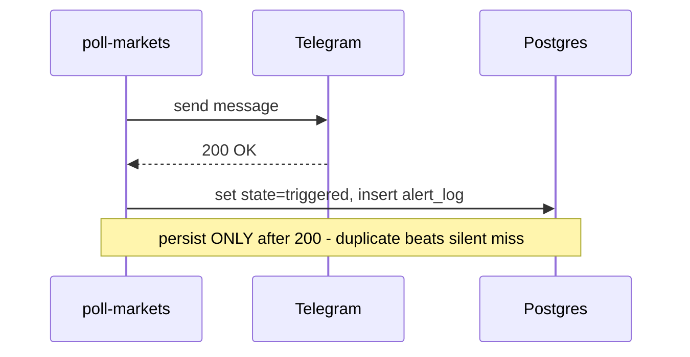

# Alert Delivery Reliability

The ordering invariant that governs how a fired alert is delivered and recorded.
This is an easily-broken invariant, so the reasoning is recorded explicitly.

## Key Facts

- **The Telegram message is sent BEFORE any state is persisted; `state` flips to
  `'triggered'` and the `alert_log` row is written only after a confirmed 200
  from Telegram** — because a lost-but-recorded alert never retries (a permanent
  silent miss), whereas a sent-but-unrecorded alert at worst produces a
  duplicate on the next tick. For an alerting tool, a duplicate is strictly
  better than a silent miss, so the ordering deliberately favors the duplicate.
- **All failures fail toward a recoverable missed-tick, never toward a wrong
  persisted state** — because the poll runs every 5 minutes and self-heals on
  the next tick, but a wrong persisted state (e.g. marked `triggered` when no
  message was sent) causes a permanent miss or false silence that never
  corrects itself.
- **Each market's fetch/evaluate/notify is isolated in its own try/catch** —
  because one bad market (e.g. a wrong slug returning 404) must not abort the
  whole batch; it logs and the remaining markets still get processed.

## Details

Concretely, a Polymarket fetch failure (timeout, 5xx, unparseable JSON) results
in skip-this-market-this-tick with no state change. A Telegram failure aborts
the persist step for that alert, leaving it `armed` so it retries next tick.

## Workflow Diagram

## Sources

- Polymarket → Telegram alerts design session, 2026-06-14
  (see `docs/superpowers/specs/2026-06-14-polymarket-telegram-alerts-design.md`)
