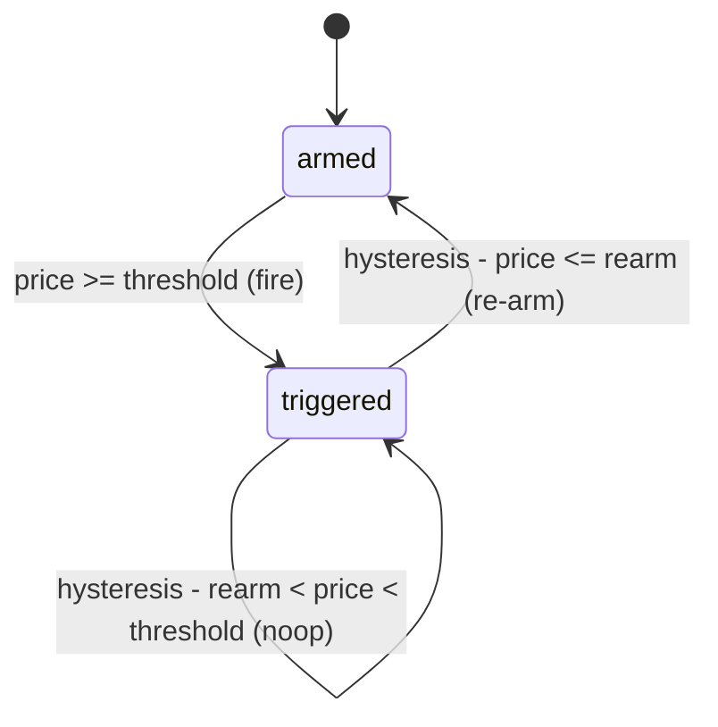

# Alerting Strategy Design

How and when the tool decides to fire a Telegram alert once a market's
probability meets a threshold. The whole design exists to deliver high-value
crossing notifications without spamming the user when prices oscillate.

## Key Facts

- **`once` is the default strategy (fire once on crossing, then terminal)** —
  because a prediction market resolves only once, so a single "crossed your
  threshold" notification is the high-value signal and repeats are noise. It is
  also completely immune to flip-flop spam since there is no re-arm path at all.
- **`hysteresis` re-arms at a *lower* threshold than it fires at (deadband)** —
  because re-arming at the same threshold causes alert spam when a noisy price
  oscillates around it (e.g. 81% → 79% → 81%). A deadband (fire at 80%, re-arm
  at 70%) absorbs the oscillation. This is the standard engineering fix — the
  same principle a thermostat uses.
- **Alerting is edge-triggered, not level-triggered** — fire on the *transition*
  from below to ≥ threshold, not on the ongoing state. Level-triggered would
  re-fire every poll while above the line, which is the classic cause of
  monitor spam.
- **Cooldown, debounce/sustained, and nag/repeat strategies were considered and
  deliberately deferred to the web-app phase** — they are legitimate strategies,
  but unnecessary for a hand-tuned personal script with one or two events. They
  add config surface that buys nothing until there are many alerts the user
  can't babysit.

## Details

The two supported strategies are expressed by a single two-state machine
(`armed` → `triggered`). `once` is simply `hysteresis` with the re-arm
transition removed — so the implementation is one mechanism with an optional
re-arm edge, not two separate code paths. The decision is a pure function:
`(price, threshold, strategy, rearm_threshold, state) → {action, next_state}`
where `action ∈ {fire, rearm, noop}`.

Deferred strategies, for the record:
- **Cooldown / rate-limit** — after firing, mute for a fixed window, then become
  eligible again.
- **Debounce / sustained ("for" duration)** — only fire once the condition has
  held for N consecutive polls; filters a single noisy trade spiking a thin
  market.
- **Nag / repeat** — keep reminding while still above threshold. Rejected as
  actively annoying for this use case.

## Workflow Diagram

## Sources

- Polymarket → Telegram alerts design session, 2026-06-14
  (see `docs/superpowers/specs/2026-06-14-polymarket-telegram-alerts-design.md`)
